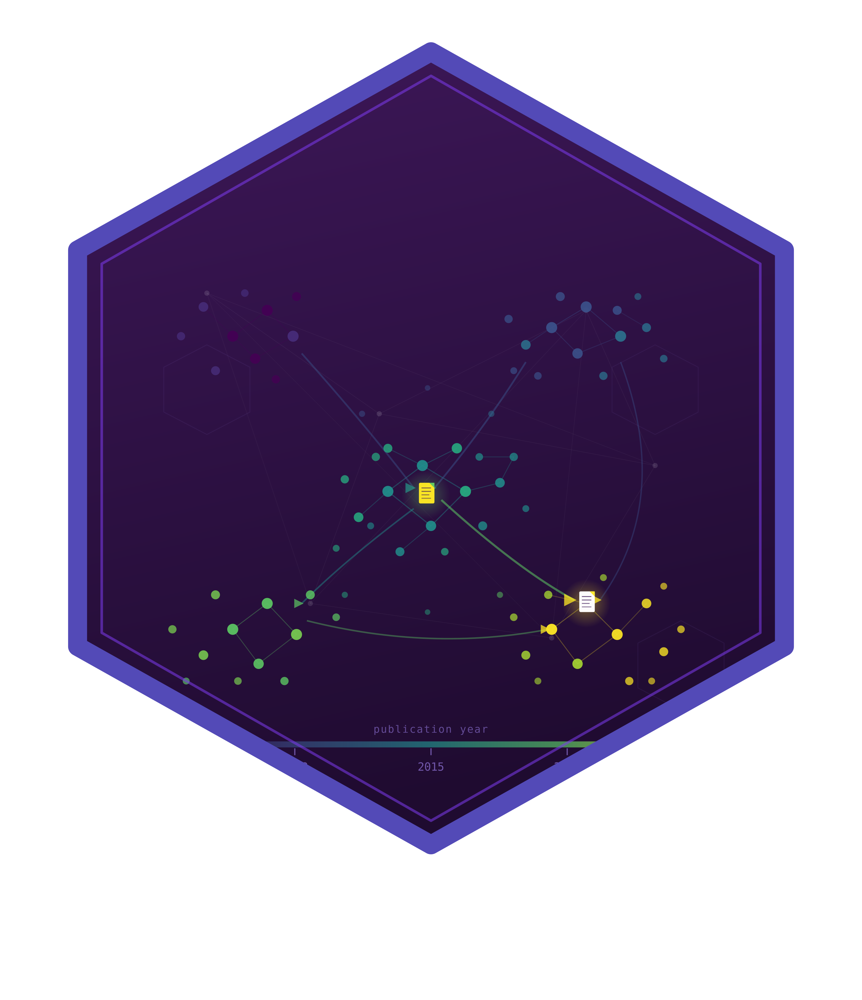

<!-- README.md is generated from README.Rmd. Please edit that file -->

```{r, include = FALSE}
knitr::opts_chunk$set(
  collapse = TRUE,
  comment = "#>",
  fig.path = "man/figures/README-",
  out.width = "100%"
)
```

# scimapR 

<!-- badges: start -->
[](https://github.com/r-heller/scimapR/actions/workflows/R-CMD-check.yaml)
[](https://lifecycle.r-lib.org/articles/stages.html#experimental)
<!-- badges: end -->

**The reproducible, equity-aware, question-driven, AI-assisted bibliometric
toolkit for working biomedical researchers.**

scimapR is a comprehensive R package for bibliometric and scientometric
analysis. It provides unified ingestion from 12+ bibliographic sources,
classical and modern science-mapping analytics, embedding-based research
cluster discovery, and a publication-ready Shiny application -- all in one
CRAN-compatible package with tibble-based outputs and viridis-themed
visualisations.

## What makes scimapR distinctive

- **Live corpus refresh.** Your corpus knows when it was last refreshed,
  what is stale, and how to update itself (`sm_refresh()`, `sm_staleness()`,
  `sm_lock()`).
- **Research questions as first-class objects.** Build structured PICO/PECO
  questions, auto-generate search queries, and screen with optional LLM
  grounding (`sm_question()`, `sm_screen_against_question()`).
- **Reproducible-by-construction corpus certificates.** A YAML document
  that another researcher can use to re-derive your exact corpus
  (`sm_certificate()`, `sm_rebuild_from_cert()`).
- **Author trajectory analysis.** Track topic pivots, collaborator turnover,
  and productivity curves across a career (`sm_author_trajectory()`).
- **Equity and representation auditing.** Geographic, gender, funding, and
  OA audits with built-in confidence reporting and epistemic humility
  (`sm_audit_geographic()`, `sm_audit_gender()`).
- **LLM-grounded corpus chat.** Ask questions about your corpus with every
  claim anchored to actual works -- no hallucinated references
  (`sm_chat()`).

## Relationship to bibliometrix

scimapR is **inspired by and designed as a complement to** the excellent
[bibliometrix](https://www.bibliometrix.org/) package by Massimo Aria and
Corrado Cuccurullo (2017, *Journal of Informetrics*,
[doi:10.1016/j.joi.2017.08.007](https://doi.org/10.1016/j.joi.2017.08.007)).

bibliometrix is the foundational R package for science mapping. It pioneered
many of the analyses that scimapR also provides. **scimapR is not a fork,
not a derivative, and contains no code copied or adapted from bibliometrix.**
For shared bibliographic formats, scimapR ships clean-room parsers written
from public format specifications.

First-class round-trip interop is provided:

```r
M <- sm_to_bibliometrix(corpus)            # use with bibliometrix
corpus <- as_sm_corpus(M)                  # come back to scimapR
```

See `vignette("relationship-to-bibliometrix")` for details.

## Installation

```r
# Install from GitHub (development version)
# install.packages("pak")
pak::pak("r-heller/scimapR")
```

## Quick example

```{r example}
library(scimapR)

# Generate a synthetic corpus
corpus <- sm_example_corpus(n_works = 100, seed = 42)
print(corpus)

# Visualise production
sm_plot_production(corpus)
```

## Feature overview

| Module | Functions |
|--------|-----------|
| File ingestion | `sm_read_bib()`, `sm_read_ris()`, `sm_read_wos()`, `sm_read_scopus()`, `sm_read_pubmed_xml()`, ... |
| API ingestion | `sm_fetch_openalex()`, `sm_fetch_crossref()`, `sm_fetch_pubmed()`, `sm_fetch_semantic_scholar()`, ... |
| Enrichment | `sm_enrich_unpaywall()`, `sm_enrich_altmetric()`, `sm_enrich_concepts()`, ... |
| Networks | `sm_network_citation()`, `sm_network_cocitation()`, `sm_network_coupling()`, `sm_network_collab()`, `sm_network_coword()` |
| Embeddings | `sm_embed_works()`, `sm_cluster_hdbscan()`, `sm_cluster_leiden()`, `sm_cluster_label()` |
| Indicators | `sm_metric_h_index()`, `sm_metric_disruption()`, `sm_metric_rcr()`, `sm_metric_fnci()`, `sm_metric_novelty()` |
| Visualisation | `sm_plot_landscape()`, `sm_plot_thematic_map()`, `sm_plot_production()`, `sm_plot_equity_dashboard()`, ... |
| Export | `sm_export_figure()`, `sm_export_table()`, `sm_export_zip()`, `sm_export_gephi()` |
| Shiny app | `sm_run_app()` |

## Documentation

- `vignette("scimapR")` -- Getting started
- `vignette("ingestion")` -- Building a corpus
- `vignette("embeddings-and-clusters")` -- Semantic landscape
- `vignette("modern-indicators")` -- CD/RCR/FNCI/novelty
- `vignette("question-driven-reviews")` -- Research questions + screening
- `vignette("reproducibility-and-certificates")` -- Corpus certificates
- `vignette("equity-trajectory-and-chat")` -- Equity audit + trajectories
- `vignette("relationship-to-bibliometrix")` -- Interop and credit

## Acknowledgements

scimapR stands on the shoulders of the bibliometrix project. We are deeply
grateful to Massimo Aria and Corrado Cuccurullo for creating the foundational
R package for science mapping, and for their landmark 2017 paper which
defined the field of R-based bibliometrics.

We also acknowledge the many data sources that make scimapR possible:
[OpenAlex](https://openalex.org/), [Crossref](https://www.crossref.org/),
[PubMed](https://pubmed.ncbi.nlm.nih.gov/),
[Semantic Scholar](https://www.semanticscholar.org/),
[Unpaywall](https://unpaywall.org/), and others.

## Citation

```r
citation("scimapR")
```

Please cite **both** scimapR and bibliometrix when using this package.

## License

MIT

## Contributing

Issues and pull requests are welcome at
[github.com/r-heller/scimapR](https://github.com/r-heller/scimapR).
