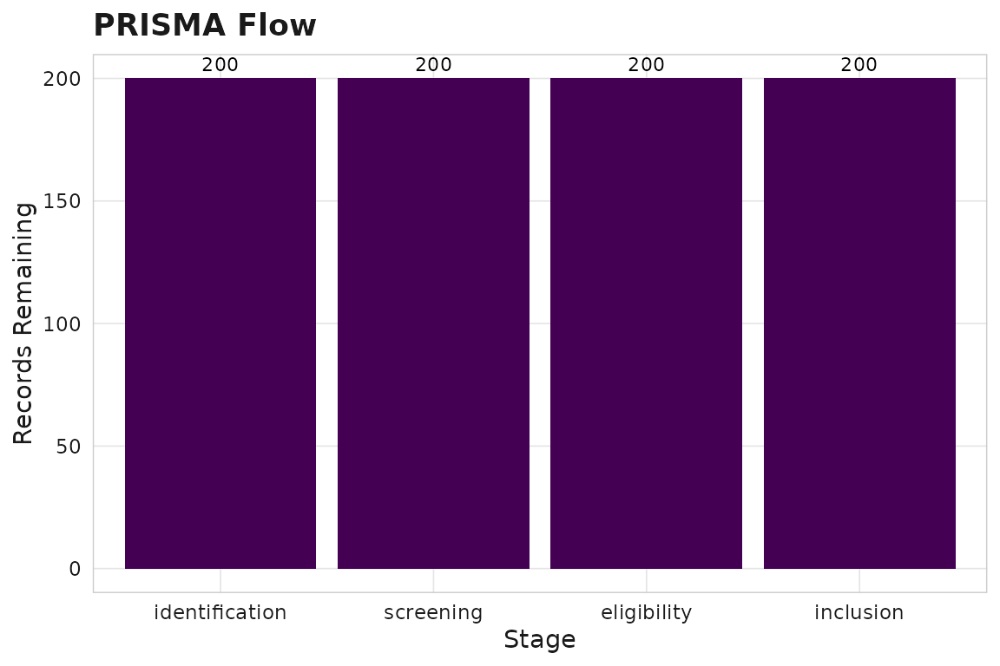

# Question-Driven Reviews

[](https://github.com/CTTIR/scimapR/actions/workflows/R-CMD-check.yaml)
[](https://cttir.github.io/scimapR/)
[](https://CRAN.R-project.org/package=scimapR)
[](https://app.codecov.io/gh/CTTIR/scimapR?branch=main)
[](https://cran.r-project.org/package=scimapR)
[](https://cran.r-project.org/package=scimapR)
[](https://opensource.org/licenses/MIT)
[](https://lifecycle.r-lib.org/articles/stages.html#experimental)

## Research questions as objects

scimapR treats research questions as structured objects, not just query
strings.

``` r

library(scimapR)
```

``` r

rq <- sm_question(
 text = "Does spatial transcriptomics improve outcome prediction in colorectal cancer?",
 framework = "PICO",
 population = "colorectal cancer patients",
 intervention = "spatial transcriptomics",
 outcome = "survival or recurrence"
)
print(rq)
#> 
#> ── <sm_question> ───────────────────────────────────────────────────────────────
#> ID: Q-ecd0161dbb634ba3
#> Framework: PICO
#> Created: 2026-08-22 13:19:27
#> 
#> Question:
#> Does spatial transcriptomics improve outcome prediction in colorectal cancer?
#> 
#> ── Structured fields
#> Population: colorectal cancer patients
#> Intervention: spatial transcriptomics
#> Outcome: survival or recurrence
#> 
#> Languages: en
#> 
#> ── Query strings
#> generic: (colorectal cancer patients) AND (spatial transcriptomics) AND
#> (survival or r...
#> pubmed: (colorectal cancer patients[tiab]) AND (spatial transcriptomics[tiab])
#> AND (s...
#> openalex: (colorectal cancer patients) AND (spatial transcriptomics) AND
#> (survival or r...
#> crossref: (colorectal cancer patients) AND (spatial transcriptomics) AND
#> (survival or r...
```

## Building a corpus from a question

``` r

# In production, this hits APIs:
corpus <- sm_corpus_for_question(rq, sources = c("pubmed", "openalex"))
```

For this vignette, we use the synthetic example corpus:

``` r

corpus <- sm_example_corpus(with_screening = TRUE, seed = 42)
```

## Screening

### Regex-based (deterministic)

``` r

screened <- sm_screen_regex(
 corpus,
 include_terms = c("transcriptom", "spatial"),
 exclude_terms = c("mouse", "drosophila")
)
#> ✔ Regex screening: 73 included, 127 excluded.
nrow(screened$works)
#> [1] 200
```

### LLM-grounded screening

``` r

# Requires ellmer package and an API key
screened <- sm_screen_against_question(
 corpus, rq,
 llm = ellmer::chat_anthropic(),
 stages = "title-abstract"
)
```

### Screening summary

``` r

sm_screen_summary(corpus)
#> 
#> ── Stage: title-abstract (n=200)
#> exclude: 96 (48%)
#> include: 82 (41%)
#> unclear: 22 (11%)
#> # A tibble: 3 × 4
#>   stage          decision     n   pct
#>   <chr>          <chr>    <int> <dbl>
#> 1 title-abstract exclude     96    48
#> 2 title-abstract include     82    41
#> 3 title-abstract unclear     22    11
```

## PRISMA flow

``` r

prisma <- sm_screen_prisma(corpus)
prisma$counts
#> # A tibble: 4 × 4
#>   stage          n_entering n_excluded n_remaining
#>   <chr>               <int>      <int>       <int>
#> 1 identification        200          0         200
#> 2 screening             200          0         200
#> 3 eligibility           200          0         200
#> 4 inclusion             200          0         200
prisma$plot
```



## Export for Rayyan/Covidence

``` r

sm_export_rayyan(corpus, "my_corpus.ris")
sm_export_covidence(corpus, "my_corpus_covidence.ris")
```
