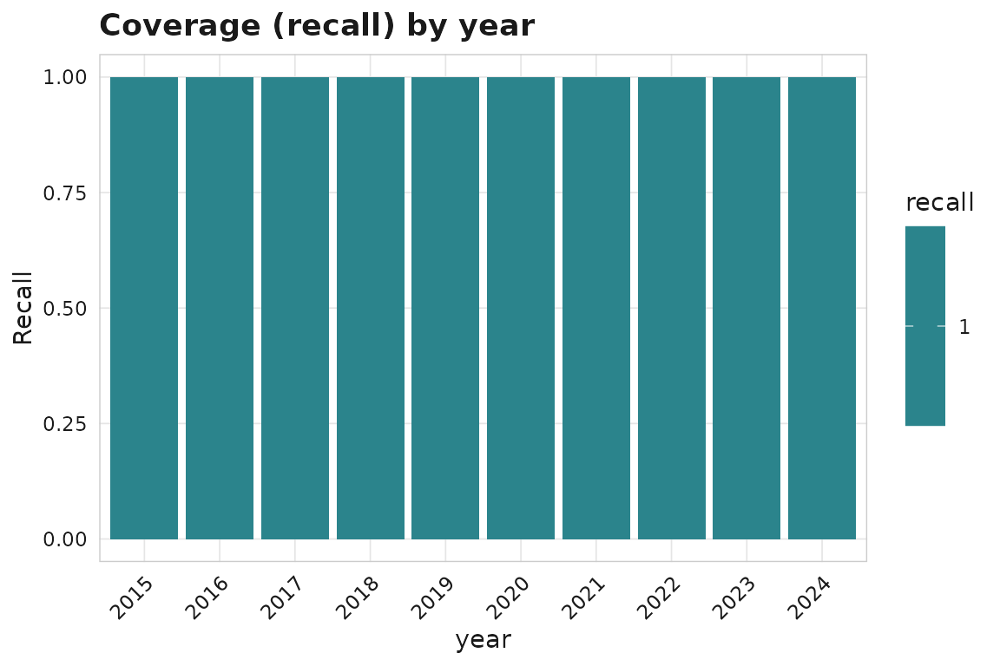
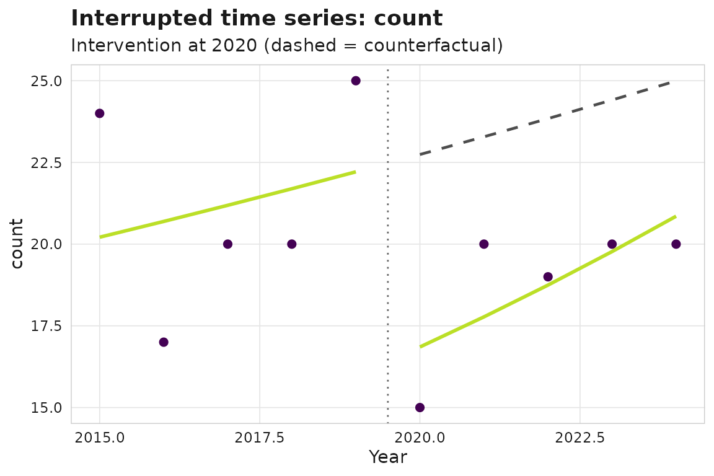

# Research-management analytics: coverage, attribution, and policy evaluation

This article walks an end-to-end research-management study: auditing an
institution’s publication output against a ground-truth tracker,
capturing affiliations robustly, evaluating whether an intervention
changed output, and summarising impact defensibly. Everything runs on
synthetic example data.

## A reproducible starting corpus

For arbitrary tabular sources,
[`sm_corpus_from_tables()`](https://cttir.github.io/scimapR/reference/sm_corpus_from_tables.md)
is the recommended ingestion path: it validates required columns,
coerces types, fills missing optional tables, and returns a valid
`sm_corpus`.

``` r

works <- data.frame(
  work_id = paste0("W", 1:4),
  title = c("Spatial transcriptomics in cancer",
            "Immune checkpoint resistance",
            "A trial of biomarker discovery",
            "Single-cell atlas of the tumour"),
  year = c("2018", "2019", "2020", "2021"),   # character -> coerced to integer
  doi = paste0("10.1234/example.", 1:4),
  cited_by_count = c(40, 12, 5, 1)
)
corpus <- sm_corpus_from_tables(list(works = works))
corpus
```

For the rest of the article we use the larger built-in synthetic corpus.

``` r

corpus <- sm_example_corpus(n_works = 200, seed = 1)
```

## 1. Coverage auditing

Suppose a manual tracker lists the works the institution *should* have.
We can measure recall and precision of the corpus against it, and see
which years are worst covered.

``` r

reference <- corpus$works[1:150, c("work_id", "doi", "title", "year")]
names(reference)[1] <- "id"

cov <- sm_coverage_audit(corpus, reference, by = "year", match = "doi")
cov
summary(cov)
#> # A tibble: 1 × 8
#>   recall precision    f1 n_corpus n_reference n_matched n_corpus_only
#>    <dbl>     <dbl> <dbl>    <int>       <int>     <int>         <int>
#> 1      1      0.75 0.857      200         150       150            50
#> # ℹ 1 more variable: n_reference_only <int>
```

``` r

ggplot2::autoplot(cov)
```



Breakdowns are returned as a single flat tibble; use
[`sm_coverage_breakdowns()`](https://cttir.github.io/scimapR/reference/sm_coverage_breakdowns.md)
to access or filter them:

``` r

sm_coverage_breakdowns(cov, dimension = "year")
#> # A tibble: 10 × 8
#>    dimension level n_reference n_matched recall n_corpus precision    f1
#>    <chr>     <chr>       <int>     <int>  <dbl>    <int>     <dbl> <dbl>
#>  1 year      2015           18        18      1       24     0.75  0.857
#>  2 year      2016           12        12      1       17     0.706 0.828
#>  3 year      2017           15        15      1       20     0.75  0.857
#>  4 year      2018           16        16      1       20     0.8   0.889
#>  5 year      2019           19        19      1       25     0.76  0.864
#>  6 year      2020            9         9      1       15     0.6   0.75 
#>  7 year      2021           16        16      1       20     0.8   0.889
#>  8 year      2022           13        13      1       19     0.684 0.812
#>  9 year      2023           17        17      1       20     0.85  0.919
#> 10 year      2024           15        15      1       20     0.75  0.857
```

Source coverage can be checked against a journal master list by ISSN
([`sm_journal_in_index()`](https://cttir.github.io/scimapR/reference/sm_journal_in_index.md)),
and two corpora reconciled by content with
[`sm_reconcile()`](https://cttir.github.io/scimapR/reference/sm_reconcile.md).

``` r

ref_index <- utils::read.csv(
  system.file("extdata", "example_journal_index.csv", package = "scimapR"),
  stringsAsFactors = FALSE
)
sm_journal_in_index(c("1078-8956", "9999-9999"), index = "doaj",
                    reference_list = ref_index)
#> # A tibble: 2 × 5
#>   issn      index in_index matched_title   matched_issn_type
#>   <chr>     <chr> <lgl>    <chr>           <chr>            
#> 1 1078-8956 doaj  TRUE     Nature Medicine print            
#> 2 9999-9999 doaj  FALSE    NA              NA
```

Passing the same index to `sm_coverage_audit(index_table = )` assesses
*record capture* and *journal indexability* together – “did we capture
this paper” and “is its journal indexed” in one pass:

``` r

cov_idx <- sm_coverage_audit(corpus, reference, match = "doi",
                             index_table = ref_index)
cov_idx$indexability
#> # A tibble: 1 × 2
#>   indexable n_records
#>   <lgl>         <int>
#> 1 FALSE           200
```

## 2. Affiliation capture and attribution

Hand-rolled affiliation regex is brittle.
[`sm_affiliation_match()`](https://cttir.github.io/scimapR/reference/sm_affiliation_match.md)
uses a maintained, extensible dictionary (with multilingual variants and
an email-domain fallback), and
[`sm_attribute_institution()`](https://cttir.github.io/scimapR/reference/sm_attribute_institution.md)
rolls matches up to a controlled vocabulary.

``` r

corpus$authorships$raw_affiliation[1:3] <- c(
  "Bundeswehrkrankenhaus Berlin",
  "Charite - Universitatsmedizin Berlin",
  "Walter Reed Army Institute of Research"
)
corpus <- sm_affiliation_match(corpus)
ror <- utils::read.csv(
  system.file("extdata", "example_ror.csv", package = "scimapR"),
  stringsAsFactors = FALSE
)
corpus <- sm_attribute_institution(corpus, vocabulary = "ror", ror_table = ror)
```

`match_signal` is a factor with an exported, stable level set
([`sm_affiliation_signals()`](https://cttir.github.io/scimapR/reference/sm_affiliation_signals.md)),
so you can filter reliably — for example to keep only name-token matches
and inspect the evidence that triggered them:

``` r

sm_affiliation_signals()
#> [1] "name_token"   "email_domain" "postcode"     "none"
summary_tbl <- sm_affiliation_summary(corpus)
subset(summary_tbl, match_signal == "name_token",
       select = c(institution, match_signal, n_works, example_evidence))
#> # A tibble: 3 × 4
#>   institution         match_signal n_works example_evidence     
#>   <chr>               <fct>          <int> <chr>                
#> 1 Bundeswehr Hospital name_token         1 Bundeswehrkrankenhaus
#> 2 Charite Berlin      name_token         1 Charite              
#> 3 Walter Reed         name_token         1 Walter Reed
```

The `example_evidence` column (and the per-authorship `match_evidence`
column) give an audit trail: which signal matched, on what string.

> **Stability.** Accessors like
> [`sm_affiliation_summary()`](https://cttir.github.io/scimapR/reference/sm_affiliation_summary.md)
> and `sm_coverage_breakdowns(tidy = TRUE)` follow scimapR’s accessor
> return-type contract (`?scimapR-stability`): their documented columns
> change only via a `lifecycle` deprecation, so pipelines built on them
> do not break across releases.

## 3. Policy evaluation

Did an intervention in 2020 change output? An interrupted time series
fits a level shift and slope change with a counterfactual.

``` r

its <- sm_its(corpus, intervention_year = 2020, outcome = "count")
its
ggplot2::autoplot(its)
```



For citation-based outcomes, citation-immature recent years are excluded
automatically
([`sm_citation_maturity()`](https://cttir.github.io/scimapR/reference/sm_citation_maturity.md)
exposes the same flags on `works`).

A treated-vs-control comparison uses difference-in-differences. Here we
tag two illustrative institution groups.

``` r

corpus$authorships$institution_name <- rep(
  c("Treated Inst", "Control Inst"),
  length.out = nrow(corpus$authorships))

did <- sm_did(corpus, treated = "Treated Inst", control = "Control Inst",
              intervention_year = 2020, outcome = "count")
did
```

## 4. Counting and robust impact

Fractional counting attributes a multi-author paper’s single unit of
credit across its contributors.

``` r

head(sm_count(corpus, method = "fractional", level = "author"), 5)
#> # A tibble: 5 × 5
#>   entity_id  entity_name    n_works credit weighted_citations
#>   <chr>      <chr>            <int>  <dbl>              <dbl>
#> 1 A000000001 Raj Fischer         41  10.2               191. 
#> 2 A000000049 Mohammed Liu        16   4.79              103. 
#> 3 A000000060 Mohammed Kumar      13   4.68               64.3
#> 4 A000000070 Mei Mueller         13   4.38               91.3
#> 5 A000000041 Raj Andersson       11   4.16               79.9
```

Heavy-tailed metrics are summarised robustly with medians, bootstrap
CIs, and the proportion of papers in the global top 10%.

``` r

sm_metric_summary(corpus, metric = "citations", seed = 1, n_boot = 500)
#> # A tibble: 1 × 8
#>   metric        n  mean median median_ci_low median_ci_high pp_top10 n_boot
#>   <chr>     <int> <dbl>  <dbl>         <dbl>          <dbl>    <dbl>  <int>
#> 1 citations   200  15.6     13            11           15.5      0.1    500
```

## 5. Reproducible reporting

Finally,
[`sm_figure_manifest()`](https://cttir.github.io/scimapR/reference/sm_figure_manifest.md)
turns a directory of exported figures into a captions / alt-text
manifest for the manuscript.

``` r

dir <- withr::local_tempdir()
gg <- ggplot2::autoplot(its)
ggplot2::ggsave(file.path(dir, "fig_its.png"), gg, width = 6, height = 4,
                dpi = 150)
sm_figure_manifest(dir)
#> # A tibble: 1 × 6
#>   file        caption alt_text width height   dpi
#>   <chr>       <chr>   <chr>    <int>  <int> <dbl>
#> 1 fig_its.png ""      ""         900    600    59
```

Together these functions cover the recurring tasks of a
research-coverage and impact study — audit, affiliation capture, policy
evaluation, robust summarisation, and reporting — on top of the
reproducible `sm_corpus` foundation.
