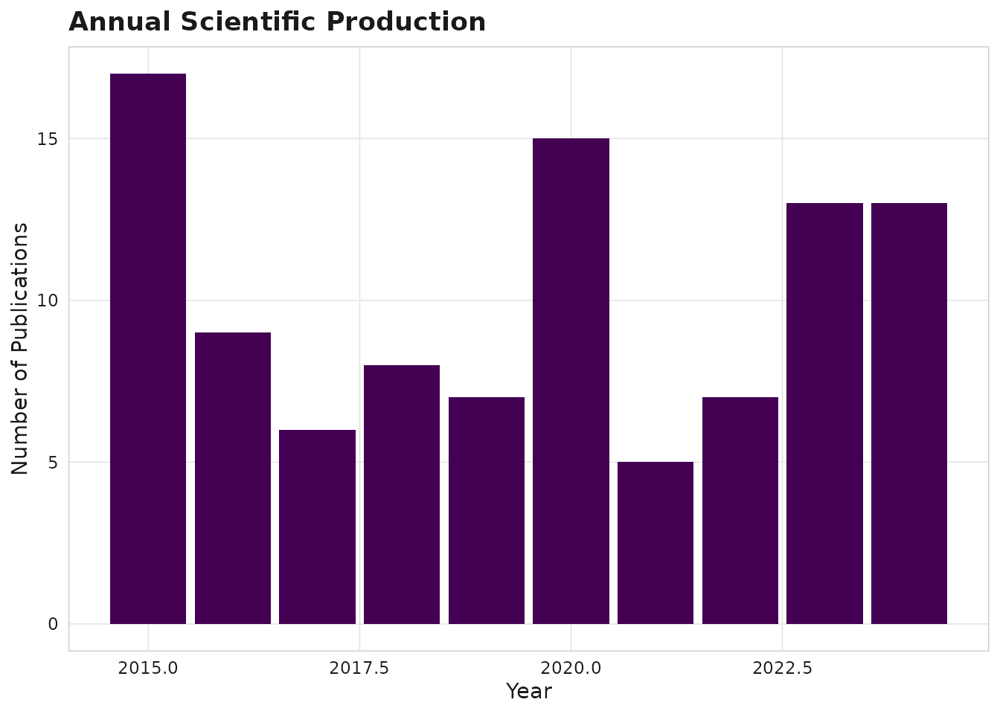
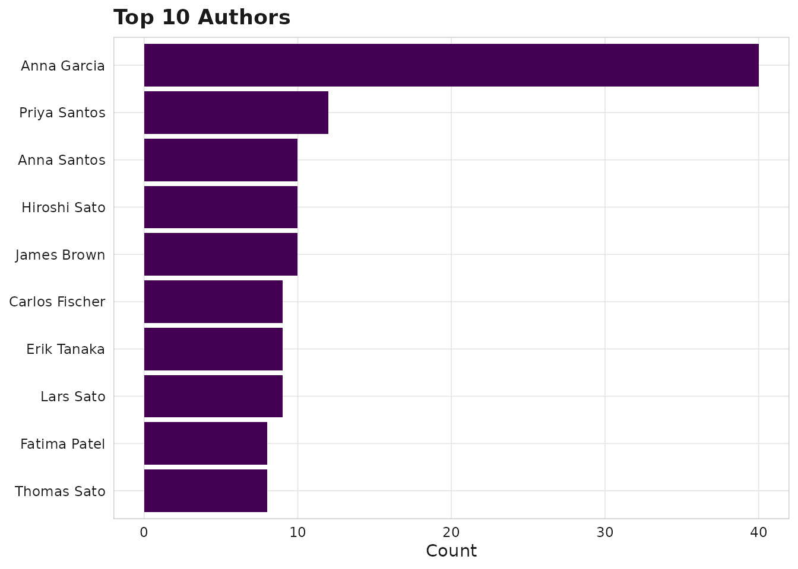
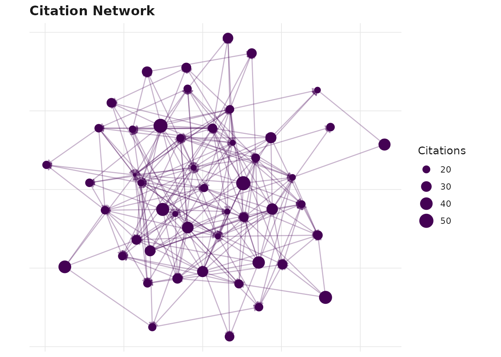

# Getting Started with scimapR

[](https://github.com/CTTIR/scimapR/actions/workflows/R-CMD-check.yaml)
[](https://cttir.github.io/scimapR/)
[](https://CRAN.R-project.org/package=scimapR)
[](https://app.codecov.io/gh/CTTIR/scimapR?branch=main)
[](https://cran.r-project.org/package=scimapR)
[](https://cran.r-project.org/package=scimapR)
[](https://opensource.org/licenses/MIT)
[](https://lifecycle.r-lib.org/articles/stages.html#experimental)

### What is scimapR?

scimapR is a comprehensive toolkit for bibliometric and scientometric
analysis in R. It is designed as a complement to the foundational
[bibliometrix](https://www.bibliometrix.org/) package, adding:

- **Live corpus refresh** with staleness tracking and locking
- **Research questions as first-class objects** with LLM-grounded
  screening
- **Reproducible-by-construction corpus certificates** for exact
  re-derivation
- **Author trajectory analysis** with topic pivots and collaborator
  turnover
- **Equity and representation auditing** with built-in epistemic
  humility
- **LLM-grounded corpus chat** with retrieval-constrained citations

### Quick start

``` r

library(scimapR)

# Generate a synthetic example corpus
corpus <- sm_example_corpus(n_works = 100, seed = 42)
print(corpus)
#> 
#> ── <sm_corpus> ─────────────────────────────────────────────────────────────────
#> Works: 100 | Authors: 80 | Institutions: 0
#> Years: 2015 - 2024
#> Sources (journals): 10
#> Embeddings: 100 x 64
#> Provenance: synthetic (100)
#> Status: Unlocked (last refreshed: 2026-08-22 13:19:44)
```

### Exploring the corpus

``` r

# View works
head(corpus$works[, c("work_id", "title", "year", "cited_by_count")])
#> # A tibble: 6 × 4
#>   work_id    title                                           year cited_by_count
#>   <chr>      <chr>                                          <int>          <int>
#> 1 W000000001 Colorectal Cancer in colorectal cancer: a met…  2023             17
#> 2 W000000002 Drug Resistance in machine learning: a cohort…  2021             24
#> 3 W000000003 Spatial Transcriptomics in single-cell RNA-se…  2024             16
#> 4 W000000004 Single-Cell RNA-Seq in gene expression: a met…  2024             22
#> 5 W000000005 Immune Checkpoint in immune checkpoint: a pro…  2024              2
#> 6 W000000006 Biomarker Discovery in spatial transcriptomic…  2022             50
```

``` r

# View authors
head(corpus$authors[, c("author_id", "display_name")])
#> # A tibble: 6 × 2
#>   author_id  display_name  
#>   <chr>      <chr>         
#> 1 A000000001 Anna Garcia   
#> 2 A000000002 Maria Kumar   
#> 3 A000000003 Fatima Mueller
#> 4 A000000004 Yuki Kumar    
#> 5 A000000005 David Brown   
#> 6 A000000006 Hiroshi Sato
```

### Visualisation

All plots use viridis colour palettes by default.

``` r

sm_plot_production(corpus)
```



Annual production

``` r

sm_plot_top(corpus, level = "authors", n = 10)
```



Top authors

### Networks and large graphs

Network plots such as
[`sm_plot_citation_network()`](https://cttir.github.io/scimapR/reference/sm_plot_citation_network.md)
and
[`sm_plot_collab()`](https://cttir.github.io/scimapR/reference/sm_plot_collab.md)
return `ggraph` objects whose layout is computed lazily at print time.
On large graphs that lazy layout (and the embedded graph) can crash a
knitr/`callr`/ workflowr render subprocess. For documents, pass
`precompute = TRUE`: the layout is computed eagerly and a self-contained
plain `ggplot` is returned, which you can
[`saveRDS()`](https://rdrr.io/r/base/readRDS.html) and print later in
the document without recomputing anything — even for a graph with a
couple of thousand nodes.

The `max_nodes` cap is **opt-in** (`NULL` by default), so existing
renders are never silently downsampled; set it only when you
deliberately want to bound a very large graph (a `cli` message reports
when it engages).

``` r

p <- sm_plot_citation_network(corpus, precompute = TRUE)
# saveRDS(p, "fig_network.rds")  # print later in the document, cheaply
p
```



### Filtering

``` r

recent <- sm_filter_works(corpus, year_range = c(2020, 2024))
nrow(recent$works)
#> [1] 53
```

### Next steps

- See
  [`vignette("ingestion")`](https://cttir.github.io/scimapR/articles/ingestion.md)
  for building corpora from real data
- See
  [`vignette("relationship-to-bibliometrix")`](https://cttir.github.io/scimapR/articles/relationship-to-bibliometrix.md)
  for interop with bibliometrix
- See
  [`vignette("embeddings-and-clusters")`](https://cttir.github.io/scimapR/articles/embeddings-and-clusters.md)
  for semantic analysis
- Run
  [`sm_run_app()`](https://cttir.github.io/scimapR/reference/sm_run_app.md)
  for the interactive Shiny explorer

## Use of LLM tools

Portions of this package were prepared with assistance from large
language model tooling for narrowly defined, non-authorial tasks:
copyediting, prose smoothing, Markdown/LaTeX formatting, scaffolding of
boilerplate files (CI configs, build scripts), code refactoring. The
tools used were [Chat
AI](https://kisski.gwdg.de/leistungen/2-02-llm-service/), the LLM
service of KISSKI (GWDG), and a self-hosted **Mistral Small (24B,
Apache-2.0)** run locally via [Ollama](https://ollama.com/) and the
`ollamar` R package — local inference only, with no data sent to third
parties for the self-hosted model.

All scientific claims, methodological choices, analyses,
interpretations, and conclusions are the author’s own. No LLM-generated
text was incorporated without review and revision, and every reference
was verified against its DOI, arXiv ID, or ISBN.
