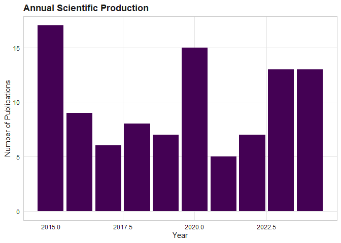

# scimapR

[](https://doi.org/10.5281/zenodo.21889960)

**The reproducible, equity-aware, question-driven, AI-assisted
bibliometric toolkit for working biomedical researchers.**

scimapR is a comprehensive R package for bibliometric and scientometric
analysis. It provides unified ingestion from 12+ bibliographic sources,
classical and modern science-mapping analytics, embedding-based research
cluster discovery, and a publication-ready Shiny application – all in
one CRAN-compatible package with tibble-based outputs and viridis-themed
visualisations.

## What makes scimapR distinctive

- **Live corpus refresh.** Your corpus knows when it was last refreshed,
  what is stale, and how to update itself
  ([`sm_refresh()`](https://cttir.github.io/scimapR/reference/sm_refresh.md),
  [`sm_staleness()`](https://cttir.github.io/scimapR/reference/sm_staleness.md),
  [`sm_lock()`](https://cttir.github.io/scimapR/reference/sm_lock.md)).
- **Research questions as first-class objects.** Build structured
  PICO/PECO questions, auto-generate search queries, and screen with
  optional LLM grounding
  ([`sm_question()`](https://cttir.github.io/scimapR/reference/sm_question.md),
  [`sm_screen_against_question()`](https://cttir.github.io/scimapR/reference/sm_screen_against_question.md)).
- **Reproducible-by-construction corpus certificates.** A YAML document
  that another researcher can use to re-derive your exact corpus
  ([`sm_certificate()`](https://cttir.github.io/scimapR/reference/sm_certificate.md),
  [`sm_rebuild_from_cert()`](https://cttir.github.io/scimapR/reference/sm_certificate.md)).
- **Author trajectory analysis.** Track topic pivots, collaborator
  turnover, and productivity curves across a career
  ([`sm_author_trajectory()`](https://cttir.github.io/scimapR/reference/sm_author_trajectory.md)).
- **Equity and representation auditing.** Geographic, gender, funding,
  and OA audits with built-in confidence reporting and epistemic
  humility
  ([`sm_audit_geographic()`](https://cttir.github.io/scimapR/reference/sm_audit_geographic.md),
  [`sm_audit_gender()`](https://cttir.github.io/scimapR/reference/sm_audit_gender.md)).
- **LLM-grounded corpus chat.** Ask questions about your corpus with
  every claim anchored to actual works – no hallucinated references
  ([`sm_chat()`](https://cttir.github.io/scimapR/reference/sm_chat.md)).

## Relationship to bibliometrix

scimapR is **inspired by and designed as a complement to** the excellent
[bibliometrix](https://www.bibliometrix.org/) package by Massimo Aria
and Corrado Cuccurullo (2017, *Journal of Informetrics*,
[doi:10.1016/j.joi.2017.08.007](https://doi.org/10.1016/j.joi.2017.08.007)).

bibliometrix is the foundational R package for science mapping. It
pioneered many of the analyses that scimapR also provides. **scimapR is
not a fork, not a derivative, and contains no code copied or adapted
from bibliometrix.** For shared bibliographic formats, scimapR ships
clean-room parsers written from public format specifications.

First-class round-trip interop is provided:

``` r

M <- sm_to_bibliometrix(corpus)            # use with bibliometrix
corpus <- as_sm_corpus(M)                  # come back to scimapR
```

See
[`vignette("relationship-to-bibliometrix")`](https://cttir.github.io/scimapR/articles/relationship-to-bibliometrix.md)
for details.

## Installation

``` r

# Install from GitHub (development version)
# install.packages("pak")
pak::pak("CTTIR/scimapR")
```

## Quick example

``` r

library(scimapR)

# Generate a synthetic corpus
corpus <- sm_example_corpus(n_works = 100, seed = 42)
print(corpus)
#> 
#> ── <sm_corpus> ─────────────────────────────────────────────────────────────────
#> Works: 100 | Authors: 80 | Institutions: 0
#> Years: 2015 - 2024
#> Sources (journals): 10
#> Embeddings: 100 x 64
#> Provenance: synthetic (100)
#> Status: Unlocked (last refreshed: 2026-06-10 09:09:01)

# Visualise production
sm_plot_production(corpus)
```



## Feature overview

| Module | Functions |
|----|----|
| File ingestion | [`sm_read_bib()`](https://cttir.github.io/scimapR/reference/sm_read_bib.md), [`sm_read_ris()`](https://cttir.github.io/scimapR/reference/sm_read_ris.md), [`sm_read_wos()`](https://cttir.github.io/scimapR/reference/sm_read_wos.md), [`sm_read_scopus()`](https://cttir.github.io/scimapR/reference/sm_read_scopus.md), [`sm_read_pubmed_xml()`](https://cttir.github.io/scimapR/reference/sm_read_pubmed_xml.md), … |
| API ingestion | [`sm_fetch_openalex()`](https://cttir.github.io/scimapR/reference/sm_fetch_openalex.md), [`sm_fetch_crossref()`](https://cttir.github.io/scimapR/reference/sm_fetch_crossref.md), [`sm_fetch_pubmed()`](https://cttir.github.io/scimapR/reference/sm_fetch_pubmed.md), [`sm_fetch_semantic_scholar()`](https://cttir.github.io/scimapR/reference/sm_fetch_semantic_scholar.md), … |
| Enrichment | [`sm_enrich_unpaywall()`](https://cttir.github.io/scimapR/reference/sm_enrich_unpaywall.md), [`sm_enrich_altmetric()`](https://cttir.github.io/scimapR/reference/sm_enrich_altmetric.md), [`sm_enrich_concepts()`](https://cttir.github.io/scimapR/reference/sm_enrich_concepts.md), … |
| Networks | [`sm_network_citation()`](https://cttir.github.io/scimapR/reference/sm_network_citation.md), [`sm_network_cocitation()`](https://cttir.github.io/scimapR/reference/sm_network_cocitation.md), [`sm_network_coupling()`](https://cttir.github.io/scimapR/reference/sm_network_coupling.md), [`sm_network_collab()`](https://cttir.github.io/scimapR/reference/sm_network_collab.md), [`sm_network_coword()`](https://cttir.github.io/scimapR/reference/sm_network_coword.md) |
| Embeddings | [`sm_embed_works()`](https://cttir.github.io/scimapR/reference/sm_embed_works.md), [`sm_cluster_hdbscan()`](https://cttir.github.io/scimapR/reference/sm_cluster_hdbscan.md), [`sm_cluster_leiden()`](https://cttir.github.io/scimapR/reference/sm_cluster_leiden.md), [`sm_cluster_label()`](https://cttir.github.io/scimapR/reference/sm_cluster_label.md) |
| Indicators | [`sm_metric_h_index()`](https://cttir.github.io/scimapR/reference/sm_metric_h_index.md), [`sm_metric_disruption()`](https://cttir.github.io/scimapR/reference/sm_metric_disruption.md), [`sm_metric_rcr()`](https://cttir.github.io/scimapR/reference/sm_metric_rcr.md), [`sm_metric_fnci()`](https://cttir.github.io/scimapR/reference/sm_metric_fnci.md), [`sm_metric_novelty()`](https://cttir.github.io/scimapR/reference/sm_metric_novelty.md) |
| Visualisation | [`sm_plot_landscape()`](https://cttir.github.io/scimapR/reference/sm_plot_landscape.md), [`sm_plot_thematic_map()`](https://cttir.github.io/scimapR/reference/sm_plot_thematic_map.md), [`sm_plot_production()`](https://cttir.github.io/scimapR/reference/sm_plot_production.md), [`sm_plot_equity_dashboard()`](https://cttir.github.io/scimapR/reference/sm_plot_equity_dashboard.md), … |
| Export | [`sm_export_figure()`](https://cttir.github.io/scimapR/reference/sm_export_figure.md), [`sm_export_table()`](https://cttir.github.io/scimapR/reference/sm_export_table.md), [`sm_export_zip()`](https://cttir.github.io/scimapR/reference/sm_export_zip.md), [`sm_export_gephi()`](https://cttir.github.io/scimapR/reference/sm_export_gephi.md) |
| Shiny app | [`sm_run_app()`](https://cttir.github.io/scimapR/reference/sm_run_app.md) |

## Documentation

- [`vignette("scimapR")`](https://cttir.github.io/scimapR/articles/scimapR.md)
  – Getting started
- [`vignette("ingestion")`](https://cttir.github.io/scimapR/articles/ingestion.md)
  – Building a corpus
- [`vignette("embeddings-and-clusters")`](https://cttir.github.io/scimapR/articles/embeddings-and-clusters.md)
  – Semantic landscape
- [`vignette("modern-indicators")`](https://cttir.github.io/scimapR/articles/modern-indicators.md)
  – CD/RCR/FNCI/novelty
- [`vignette("question-driven-reviews")`](https://cttir.github.io/scimapR/articles/question-driven-reviews.md)
  – Research questions + screening
- [`vignette("reproducibility-and-certificates")`](https://cttir.github.io/scimapR/articles/reproducibility-and-certificates.md)
  – Corpus certificates
- [`vignette("equity-trajectory-and-chat")`](https://cttir.github.io/scimapR/articles/equity-trajectory-and-chat.md)
  – Equity audit + trajectories
- [`vignette("relationship-to-bibliometrix")`](https://cttir.github.io/scimapR/articles/relationship-to-bibliometrix.md)
  – Interop and credit

## Acknowledgements

scimapR stands on the shoulders of the bibliometrix project. We are
deeply grateful to Massimo Aria and Corrado Cuccurullo for creating the
foundational R package for science mapping, and for their landmark 2017
paper which defined the field of R-based bibliometrics.

We also acknowledge the many data sources that make scimapR possible:
[OpenAlex](https://openalex.org/),
[Crossref](https://www.crossref.org/),
[PubMed](https://pubmed.ncbi.nlm.nih.gov/), [Semantic
Scholar](https://www.semanticscholar.org/),
[Unpaywall](https://unpaywall.org/), and others.

## Citation

If you use scimapR in your research, please cite **both** scimapR and
the foundational bibliometrix package:

``` r

citation("scimapR")
```

**BibTeX entries:**

``` bibtex
@Manual{scimapR,
  title = {scimapR: Reproducible, Question-Driven, Embedding-Aware Science Mapping},
  author = {Raban Heller},
  year = {2026},
  note = {R package version 0.1.0},
  url = {https://github.com/CTTIR/scimapR},
}

@Article{bibliometrix,
  title = {bibliometrix: An R-tool for comprehensive science mapping analysis},
  author = {Massimo Aria and Corrado Cuccurullo},
  journal = {Journal of Informetrics},
  year = {2017},
  volume = {11},
  number = {4},
  pages = {959--975},
  doi = {10.1016/j.joi.2017.08.007},
}
```

For a complete citation block including each data source used in your
corpus, run `sm_cite_corpus(your_corpus)`.

## Use of LLM tools

Portions of this package were prepared with assistance from large
language model tooling for narrowly defined, non-authorial tasks:
copyediting, prose smoothing, Markdown/LaTeX formatting, scaffolding of
boilerplate files (CI configs, build scripts), code refactoring. The
tools used were [Chat
AI](https://kisski.gwdg.de/leistungen/2-02-llm-service/), the LLM
service of KISSKI (GWDG), and a self-hosted **Mistral Small (24B,
Apache-2.0)** run locally via [Ollama](https://ollama.com/) and the
`ollamar` R package — local inference only, with no data sent to third
parties for the self-hosted model.

All scientific claims, methodological choices, analyses,
interpretations, and conclusions are the author’s own. No LLM-generated
text was incorporated without review and revision, and every reference
was verified against its DOI, arXiv ID, or ISBN.

## License

MIT

## Contributing

Issues and pull requests are welcome at
[github.com/CTTIR/scimapR](https://github.com/CTTIR/scimapR).
